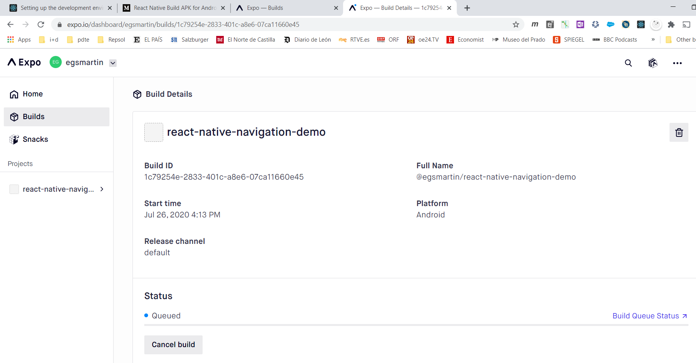
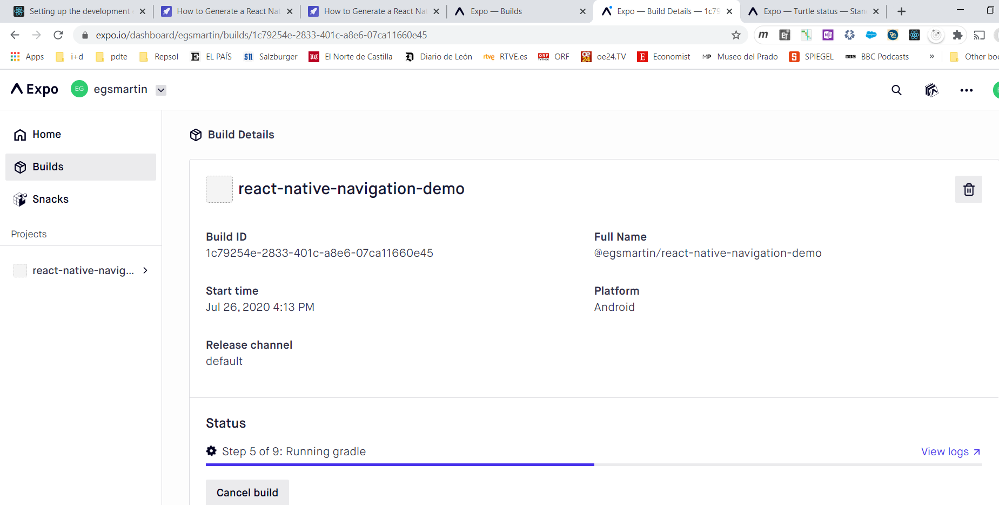

# Crear el apk

## Limpiar la cache

Expo tiene una cache de paquetes. Si vieramos que actualizamos el package.json y que expo insiste en tomar una versión diferente de la seleccionada, podemos limpiar la cache:

```ps
expo r -c
```

## Usando expo

Con este comando hacemos la compilación de nuestro cógigo en una apk android, que se subirá a `expo.io`:

```ps
expo build:android                                                                    
```

Podemos seguir la compilación en el dashboard de expo:



Tras un tiempo de espera en la cola, se lanzara la compilación:



## Usando React Native

### Pre-requisitos

Usamos el React Native CLI. react-native-cli esta deprecado. Tenemos que desinstalar el viejo:

```ps
npm uninstall -g react-native-cli
```

E instalar el nuevo:

```ps
npm i -g @react-native-community/cli
```

Creamos el template de nuestra aplicación:

```ps
npx react-native init navegacion 
```

O con typescript:

```ps
npx react-native init navegacion --template react-native-template-typescript
```

### Compilación

```ps
react-native run-android
```

# Comentarios

## Screens PreventRemove

En este caso vamos a demostrar como utilizar los distintos métodos de `navigation` para controlar como se nevega entre pantallas:

- Los métodos habituales:
    - `navigation.push('input')`. Navega a una nueva instancia de una screen, en este caso la llamada `input`
    - `navigation.pop()`. Vuelve a la instancia previa en la navegacion, y elimina la ultima instancia 
    - `navigation.goback()`. Navega hacía atrás en la historia
    - `navigation.popToTop()`. Navega hasta la raiz del navigator
    - `navigation.dispatch(action)`. Este es el método base que se utiliza en todas las navegaciones anteriores. Hay una serie de acciones definidas por defecto, y podemos tambien definir acciones custom

### navigation.dispatch & eventos de navigation

Podemos despachar una acción. Hay una serie de acciones estandard definidas en react y que estan tipificadas como `NavigationAction`. Podemos extender la acción añadiendo datos extra. Por ejemplo, podemos definir un bloque de datos que incluya un tipo nuevo opcional `payload?` que incluya un argumento opcional `confirmed?`:

```js
const action: NavigationAction & { payload?: { confirmed?: boolean } } 
```

En el listener del evento, tendremos esta action en `e.data.action`:

```js
navigation.addListener('beforeRemove', (e) => {
    const action: NavigationAction & { payload?: { confirmed?: boolean } } = e.data.action;
```

Con este snippet estamos subscribiendonos an un evento de navigator, en este caso lo que estamos diciendo es que antes de eliminar una instancia de una screen - antes de salir -, vemos cual es la action asociada al evento. En este caso usaremos la propiedad que hemos creado custom en la acción para ver si hemos confirmado que queremos salir `action.payload?.confirmed`, en caso de que no sea así, interceptamos el evento, `e.preventDefault()` - como haríamos con cualquier evento. En este ejemplo le preguntaremos al usuario con un Alert, y en caso de que confirme, continuamos con el dispatch de la acción `navigation.dispatch(action)`:

```js
if (!hasUnsavedChanges || action.payload?.confirmed) {
    return;
}

e.preventDefault();

Alert.alert(
    'Discard changes?',
    'You have unsaved changes. Are you sure to discard them and leave the screen?',
    [
    { text: "Don't leave", style: 'cancel', onPress: () => {} },
    {
        text: 'Discard',
        style: 'destructive',
        onPress: () => navigation.dispatch(action),
    },
    ]
);
```

El set-up del evento lo hacemos en el useEffect del navegador:

```js
  React.useEffect(
    () =>
      navigation.addListener('beforeRemove', (e) => {
          ...
      }),
    [hasUnsavedChanges, navigation]
  );
```

Notese que solo se ejecuta el effect cuando han cambiado las props `[hasUnsavedChanges, navigation]`. A la hora de hacer una navegacion, por ejemplo, un `goback`, podemos usar el método dispatch para poder especificar un payload junto con el `goback`:

```js
onPress={() =>
    navigation.dispatch({
    ...CommonActions.goBack(),
    payload: { confirmed: true },
    })
}
```

Vemos como efectivamente usamos la acction estandar para navegar hacia atrás, `CommonActions.goBack()`, pero que le pasamos nuestro payload. En este ejemplo, cuando navegasemos hacia atras con este botón no preguntaríamos al usuario antes de salir de la instancia de screen. Si usaramos el botón goback del header, como este viene a hacer un `navigation.goback()`, preguntaremos al usuario antes de abandonar la screen.

### Tipificar las rutas

En este ejemplo tambien demostramos como tipificar - estamos usando typescript - las rutas. 

1. Creamos un tipo nuevo que define las rutas de nuestra navegacion. En este caso estamos diciendo que habría dos rutas, una llamada `Article` que tendría un parametro string llamado author, y otra llamada `Input` que no tienen parametros definidos - al indicar `undefined` decimos que la ruta no tiene parametros. Si hicieramos `CualquierTipo | undefined` significa que el parametro es opcional.

```js
type PreventRemoveParams = {
  Article: { author: string };
  Input: undefined;
};
```

2. Al definir las screens, especificamos el tipo de parametros, y el nombre de la ruta - en este caso la llamada `Article` - que se usocia a esta screen:

```js
const ArticleScreen = ({navigation,route,}: StackScreenProps<PreventRemoveParams,'Article'>) => {
  return (
```

3. En el snipet anterior hemos visto que cada screen esta también tipificada, `StackScreenProps` en nuestro caso

4. Al crear el navegador especificamos el tipo de las rutas en el template: 

```js
//Crea una navegacion Stack usando el tipo que definimos arriba
const SimpleStack = createStackNavigator<PreventRemoveParams>();
```

```js
    <SimpleStack.Navigator>
      <SimpleStack.Screen name="Input" component={InputScreen} />
      <SimpleStack.Screen name="Article" component={ArticleScreen} />
    </SimpleStack.Navigator>
```

## Screens AuthFlow

Patron tipico utilizado para implementar una secuencia de login, logout.

- Demuestra el uso de un contexto. El contexto se gestiona en el navegador - `<AuthContext.Provider value={authContext}>`-, de modo que todas las Screens tiene acceso al contexto. El contexto incluye dos métodos, login y logout
- El navegador implementa un estado con useReducer. El estado se actualiza con los métodos del contexto. De esta forma las screens pueden usar el contexto para actualizar el estado del navegador. Cuando eso suceda el navegador re-renderizará todas las screens
- Demuestra como usar useEffect y useLayout para decidir que hacer cuando el navegador se ha contruido y es visible. 
- Al crearse el navegador se usa conditional rendering para determinar que Screen mostrar - es un Stack Navigator. 

```js
<AuthContext.Provider value={authContext}>
      <SimpleStack.Navigator
        screenOptions={{
          headerLeft: () => (
            <HeaderBackButton onPress={() => navigation.goBack()} />
          ),
        }}
      >
        {state.userToken === undefined ? (
          <SimpleStack.Screen
            name="SignIn"
            options={{
              title: 'Sign in',
              animationTypeForReplace: state.isSignout ? 'pop' : 'push',
            }}
            component={SignInScreen}
          />
        ) : (
          <SimpleStack.Screen
            name="Home"
            options={{ title: 'Home' }}
            component={HomeScreen}
          />
        )}
      </SimpleStack.Navigator>
    </AuthContext.Provider>
```
